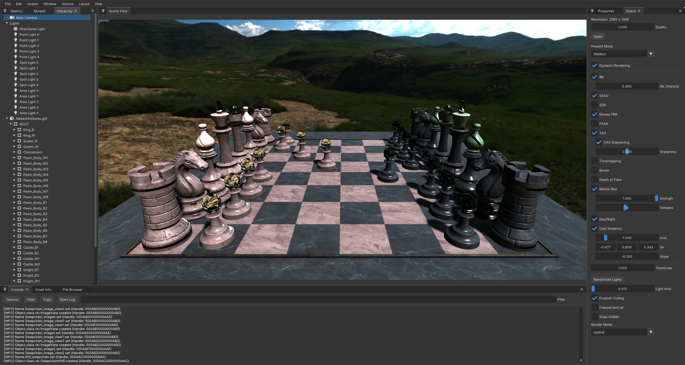

# PhasmaEngine

PhasmaEngine is intended as a project for learning 3D graphics and techniques, using Vulkan API and can run on Windows and Linux.

Until now these are the most important features PhasmaEngine has:

* Dynamic Rendering
* Deffered Rendering
* Ray Tracing
* Hybrid RT (Transparency/Trasmission/Refraction)
* Image Based Lighting
* Screen Space Ambient Occlusion
* Screen Space Reflections
* FXAA
* Upscale (TAA + RCAS)
* Tone Mapping
* Bloom
* Depth of Field
* Motion Blur
* Cascaded Shadows
* Frustum Culling
* Particles
* Physical Based Rendering
* GUI (ImGui)
* Scripts with C++
* Event System
* CPU/GPU Metrics
* Debug Console

### Building and Compiling

Phasma is using CMake to configure and generate the project files.  
The CMakeLists.txt file is in the root folder.

###### CMake  
Download [CMake](https://cmake.org/download/) and install it.  
See [CMake documentation](https://cmake.org/runningcmake/) for more information on how to use it.

###### CMake tools  
Alternatively you can use CMake tools. Different IDEs can provide these tools as a plugin or an extension, which can make the building proccess automated. For example with Visual Studio you can open a folder (instead of a .sln project). If this folder contains a CMakeLists.txt in it, it will auto detect it and it will start CMake configuration and generarion.

