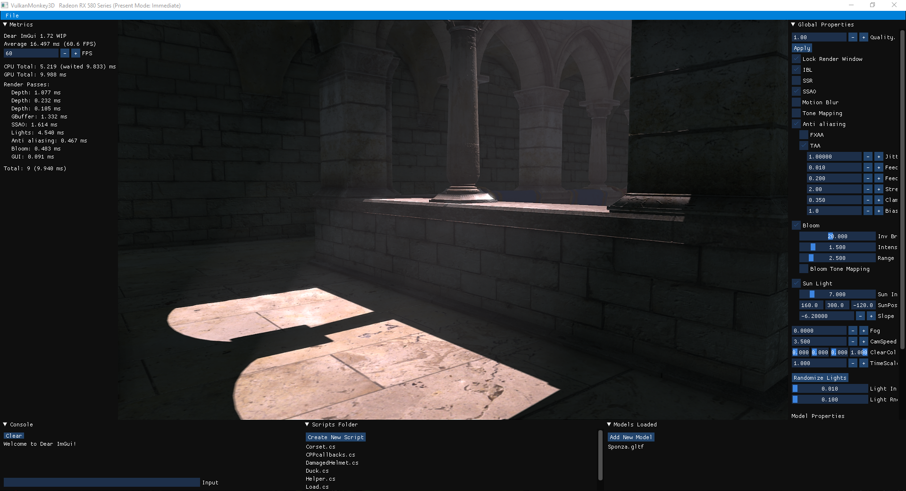

# VulkanMonkey3D

VulkanMonkey3D is intended as a project for learning 3D graphics and techniques, using the Vulkan API. Until now these are the most important features VulkanMonkey3D has:

* Deffered Rendering
* Physical Based Rendering
* Screen Space Reflections
* Screen Space Ambient Occlusion
* Tone Mapping - HDR
* Image Based Lighting
* Volumetric Lighting
* Depth of Field
* Fog
* TAA
* FXAA
* Bloom
* Motion Blur
* Cascaded Shadows
* Functional and Interactive GUI (ImGui)
* Scripts with C# (Mono)
* Event System
* Frutum Culling
* Animation
* Cube Map Reflections
* Dynamic Skybox (Day/Night)
* CPU/GPU Metrics

Here is a [demo video](https://www.youtube.com/watch?v=Dj1CpDCSy_k) with some of these features.

And some other primitive implemented ideas in a certain degree like Compute shaders.

**Building and Compiling**

Clone the repo and get CMAKE (https://cmake.org/).
To build use CMAKE and set VulkanMonkey3D folder as root, this is where CMakeLists.txt is.
Open the project in your IDE and select a build type (Debug/Release).

Noting that CMAKE will automatically copy the needed files and folders to where CMAKE_BINARY_DIR is after it runs. Any changes to these files will need to be copied again, this includes shader files, because they are getting loaded and compiled at runtime.