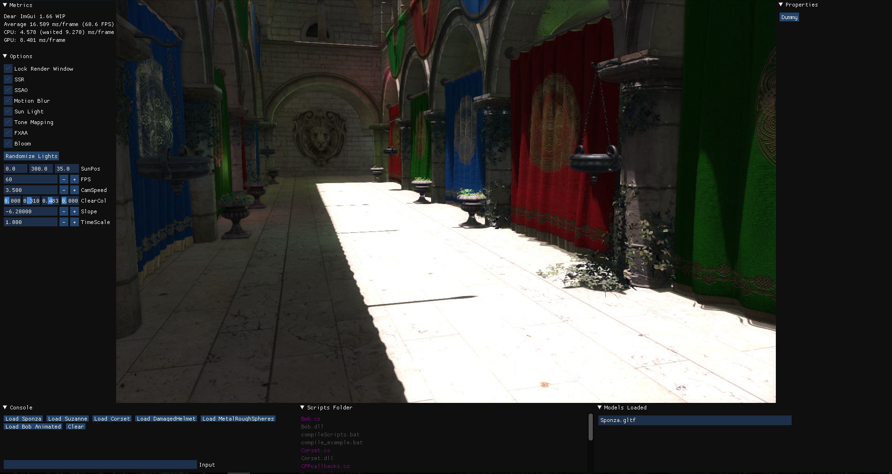
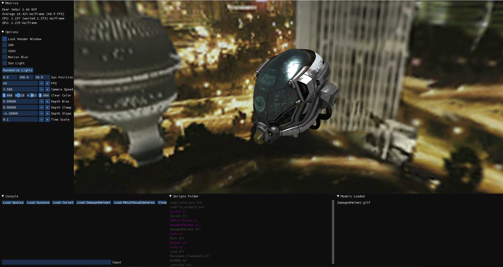

# VulkanMonkey3D

VulkanMonkey3D is intended as a project for learning 3D graphics and techniques, using the Vulkan API. Until now these are the most important features VulkanMonkey3D has:

* Deffered Rendering
* Physical Based Rendering
* Screen Space Reflections
* Screen Space Ambient Occlusion
* Tone Mapping - HDR
* FXAA
* Bloom
* Motion Blur
* Cascaded Shadows
* Functional and Interactive GUI (ImGui)
* Scripts with C# (Mono)
* Event System
* Frutum Culling
* Animation
* Cube Map Reflections
* Dynamic Skybox (Day/Night)
* CPU/GPU Metrics

And some other primitive implemented ideas in a certain degree like Compute shaders.

**Building and Compiling**

VulkanMonkey3D is a Visual Studio project with all it needs to run included in the project, except the VulkanSDK.
Install and link the [VulkanSDK](https://www.lunarg.com/vulkan-sdk/) to:
- VC++ Directories:
  - Include Directories (e.g. C:\VulkanSDK\1.1.97.0\Include;)
  - Library Directories (e.g. C:\VulkanSDK\1.1.97.0\Lib)
- C/C++ -> General:
  - Additional Include Directories (e.g. C:\VulkanSDK\1.1.97.0\Include)
- Linker -> General:
  - Additional Library Directories (e.g C:\VulkanSDK\1.1.97.0\Lib)

