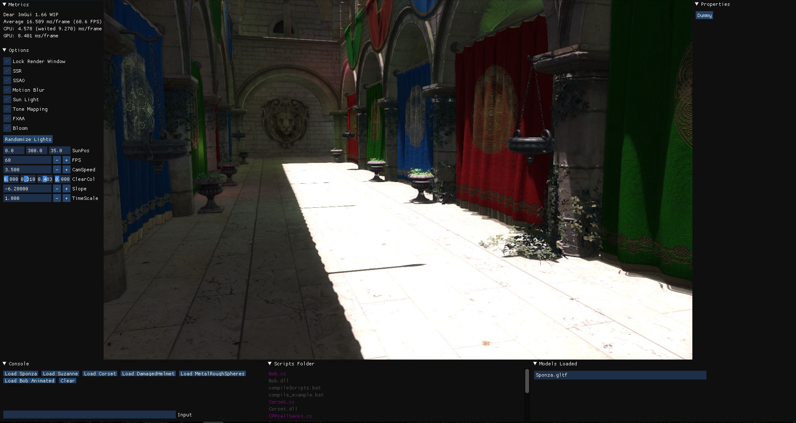
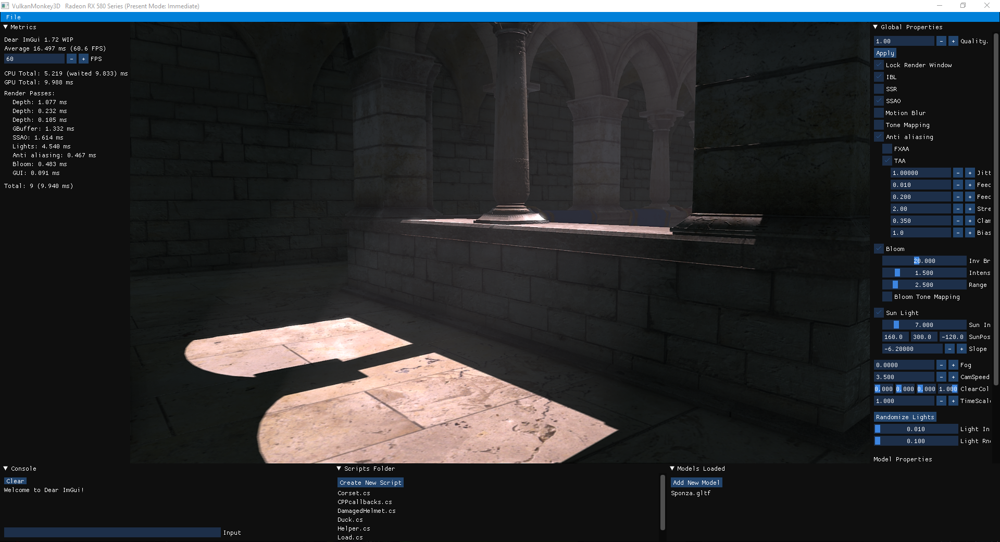
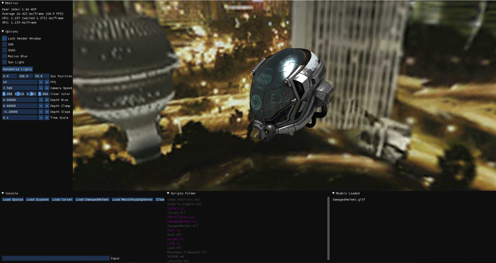
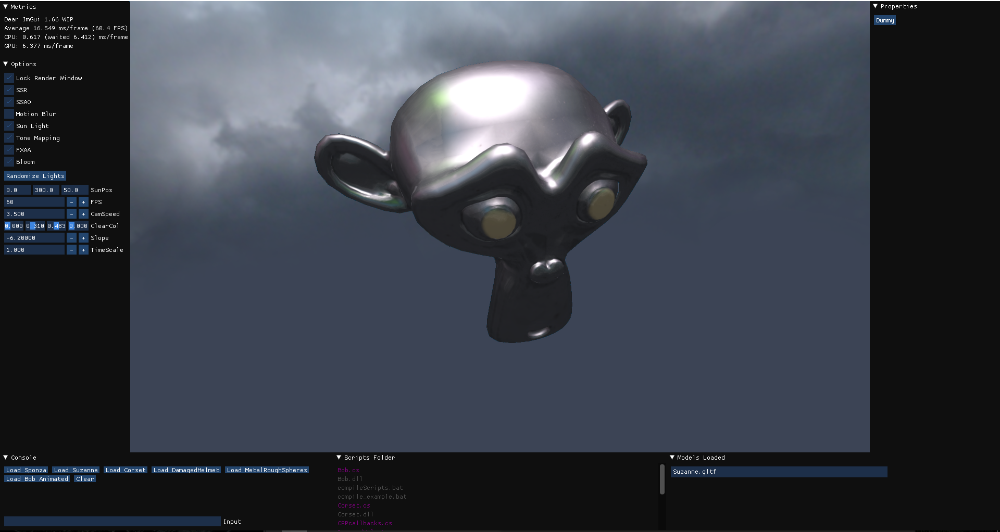

# PhasmaEngine

PhasmaEngine is intended as a project for learning 3D graphics and techniques, using Vulkan API (and soon DirectX12). Until now these are the most important features PhasmaEngine has:

* Deffered Rendering
* Physical Based Rendering
* Screen Space Reflections
* Screen Space Ambient Occlusion
* Tone Mapping - HDR
* Image Based Lighting
* Volumetric Lighting
* Depth of Field
* Upscale (FRS2)
* FXAA
* Bloom
* Motion Blur
* Cascaded Shadows
* Functional and Interactive GUI (ImGui)
* Scripts with C# (Mono) (Turned off for now)
* Event System
* Frutum Culling
* Animation
* Cube Map Reflections
* CPU/GPU Metrics

Here is a [demo video](https://www.youtube.com/watch?v=Dj1CpDCSy_k) with some of these features.

### Building and Compiling

Phasma is using CMake to configure and generate the project files.  
The CMakeLists.txt file is in the root folder.

###### CMake  
Download [CMake](https://cmake.org/download/) and install it.  
See [CMake documentation](https://cmake.org/runningcmake/) for more information on how to use it.

###### CMake tools  
Alternatively you can use CMake tools. Different IDEs can provide these tools as a plugin or an extension, which can make the building proccess automated. For example with Visual Studio you can open a folder (instead of a .sln project). If this folder contains a CMakeLists.txt in it, it will auto detect it and it will start CMake configuration and generarion.

