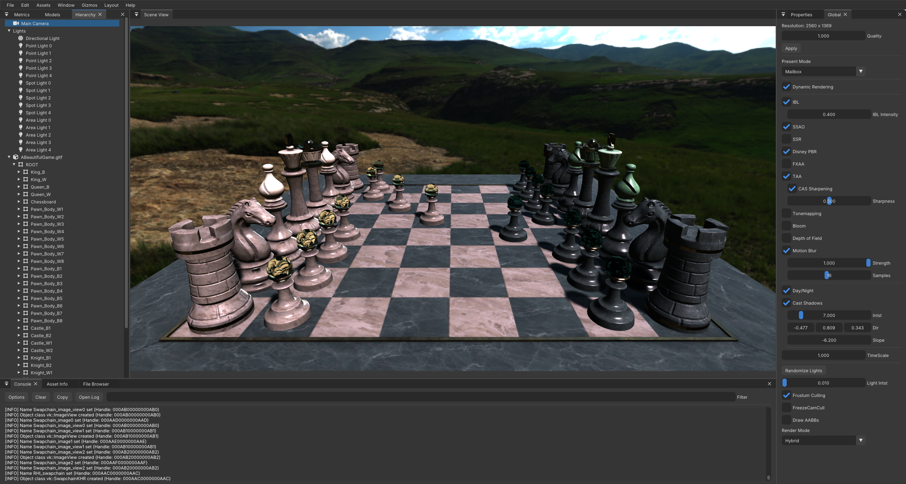

# PhasmaEngine

PhasmaEngine is a Vulkan and DirectX 12 3D engine for learning graphics techniques, with an experimental WebGPU C API layer. Vulkan runs on Windows and Linux; DX12 is Windows-only.



## Features

### Rendering
* Deferred Rendering
* Ray Tracing (Vulkan backend)
* Hybrid RT (Transparency/Transmission/Refraction, Vulkan backend)
* Physically Based Rendering (PBR)
* Image Based Lighting (IBL)
* Screen Space Ambient Occlusion (SSAO)
* Screen Space Reflections (SSR)
* Cascaded Shadow Maps
* Bloom
* Depth of Field
* Motion Blur
* Tone Mapping
* FXAA
* Temporal Anti-Aliasing with RCAS Upscale
* Frustum Culling
* Render Graph
* Day/Night Skybox with HDR environment maps

### Shaders
* HLSL shaders compiled via DXC/shaderc
* Experimental WGSL support through PhasmaWebGPU
* Shader hot-reload with file watching

### Scene
* Multiple model formats loading (via Assimp)
* Mesh optimization (via meshoptimizer)
* Directional, Point, Spot, and Area lights
* Scene save/load (.pescene)
* Particle system
* Per-axis transforms and material editing

### Editor (PhasmaEditor)
* ImGui-based editor
* CPU/GPU metrics
* Debug console
* Lua scripting
* Event system

### MCP Integration

PhasmaEngine has no in-engine LLM. Instead, PhasmaEditor runs an in-process MCP (Model Context Protocol) HTTP server at `http://127.0.0.1:8765/mcp`, letting **external** AI clients control the engine directly.

**Supported clients:**
- **Claude Code** — add `.claude/settings.json`:
  ```json
  { "mcpServers": { "phasmaeditor": { "type": "http", "url": "http://127.0.0.1:8765/mcp" } } }
  ```
- **Claude Desktop** — use `mcp-remote` bridge in `claude_desktop_config.json`:
  ```json
  "phasmaeditor": { "command": "npx", "args": ["-y", "mcp-remote", "http://127.0.0.1:8765/mcp"] }
  ```

Toggle the server from **Connection → MCP Server** in the editor. The **Connection → RAG** submenu controls codebase indexing. Status bar shows live MCP and indexing state.

**Available MCP tools:** scene/model management, camera, lights, materials, shaders, Lua execution, screenshots, mouse injection, codebase search (BM25), file read/write, and more. See [PhasmaMCP README](Phasma/MCP/README.md) for the underlying library.

## Sample Models

The glTF sample models used for testing are **not bundled** with this repository — they are large and freely available upstream. Download them externally from the Khronos glTF Sample Models repo:

> https://github.com/KhronosGroup/glTF-Sample-Models

Keep them outside the project tree. In the editor, use **File → Import** to cook a source model (glTF/FBX/OBJ/…) into the engine's portable `.pemesh` format (GPU-ready geometry + materials + embedded textures written alongside), or **File → Import → Folder** to mirror and cook a whole folder at once. The runtime (desktop **and** Android) loads only `.pemesh`; the repository itself ships only a primitives scene, so a clean checkout has no external asset dependencies.

## Optional Sample Projects

[`christoskaramou/PhasmaProjects`](https://github.com/christoskaramou/PhasmaProjects) is a companion repository for project data rather than engine source. It can contain ready-to-open project roots with `phasma_project.json`, `Assets/Scenes/*.pescene`, scripts, textures, cooked `.pemesh` meshes, and other runtime assets.

Download or clone it anywhere outside the engine checkout, for example beside `PhasmaEngine`:

```bash
git clone https://github.com/christoskaramou/PhasmaProjects.git
```

Each project should look like this:

```text
PhasmaProjects/
  MyProject/
    phasma_project.json
    Assets/
      Scenes/
      Scripts/
      Textures/
```

The manifest tells the editor and player which assets folder to use and, optionally, which scene to open first:

```json
{
    "version": 1,
    "name": "MyProject",
    "assets": "Assets",
    "startup_scene": "Assets/Scenes/sponza.pescene"
}
```

The easiest setup is through `PhasmaLauncher`: open the **Project** picker, select a project root that contains `phasma_project.json` (or select an `Assets` folder for older manifest-free projects), then choose a startup scene from `Assets/Scenes` if one is not already set by the manifest. The launcher writes the selection to `phasma_settings.json` next to the executable, and both `PhasmaEditor` and `PhasmaPlayer` use that active project assets root on launch.

If you run the editor or player directly, create or edit the executable-local `phasma_settings.json` yourself:

```json
{
    "project_path": "C:/path/to/PhasmaProjects/MyProject/",
    "project_manifest": "C:/path/to/PhasmaProjects/MyProject/phasma_project.json",
    "startup_scene": "Assets/Scenes/sponza.pescene"
}
```

Use forward slashes in paths on Windows. If the project does not have a manifest, omit `project_manifest` and point `project_path` directly at the assets folder.

## Getting the Source

PhasmaEngine uses Tracy as a Git submodule. For a normal clone, fetch submodules with the repository:

```bash
git clone --recurse-submodules https://github.com/christoskaramou/PhasmaEngine.git
```

If you already cloned without submodules, initialize them afterwards:

```bash
git submodule update --init --recursive
```

For a smaller day-to-day checkout that avoids downloading old reachable history, clone only current `master` with blob filtering:

```bash
git clone --depth 1 --single-branch --branch master --filter=blob:none --recurse-submodules --shallow-submodules --also-filter-submodules https://github.com/christoskaramou/PhasmaEngine.git
```

## Building and Compiling

PhasmaEngine uses CMake to configure and generate project files. The CMakeLists.txt is in the root folder.

## Graphics API

PhasmaEditor supports runtime graphics API selection:

- Vulkan (default, Windows/Linux): `PhasmaEditor --api vulkan`
- DirectX 12 (Windows-only): `PhasmaEditor.exe --api dx12`

You can also set `PHASMA_API` to `vulkan` or `dx12`, or write `graphics_api` / `api` in `phasma_settings.json` next to the executable.

WebGPU support is experimental and lives in `PhasmaWebGPU`, a WebGPU C API layer over PhasmaCore. It builds with the `PE_WEBGPU` CMake option and runs through dedicated WebGPU sample/test executables rather than PhasmaEditor `--api` selection.

## GitHub Release Builds

Download prebuilt packages from the [`latest` GitHub prerelease](https://github.com/christoskaramou/PhasmaEngine/releases/tag/latest):

- [PhasmaEngine-Full-Windows.zip](https://github.com/christoskaramou/PhasmaEngine/releases/download/latest/PhasmaEngine-Full-Windows.zip)
- [PhasmaEngine-Full-Linux.tar.gz](https://github.com/christoskaramou/PhasmaEngine/releases/download/latest/PhasmaEngine-Full-Linux.tar.gz)

The Windows package includes Vulkan and DX12 launchers; DX12 is Windows-only, so the Linux package ships the Vulkan backend.

**CMake:**
Download [CMake](https://cmake.org/download/) and install it.
See [CMake documentation](https://cmake.org/runningcmake/) for more information.
